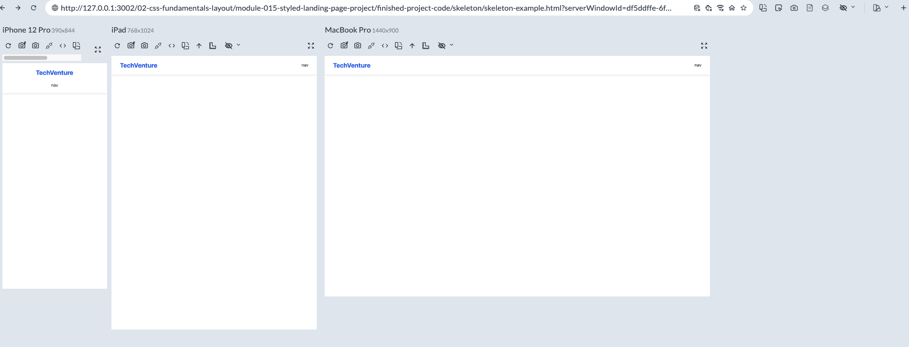
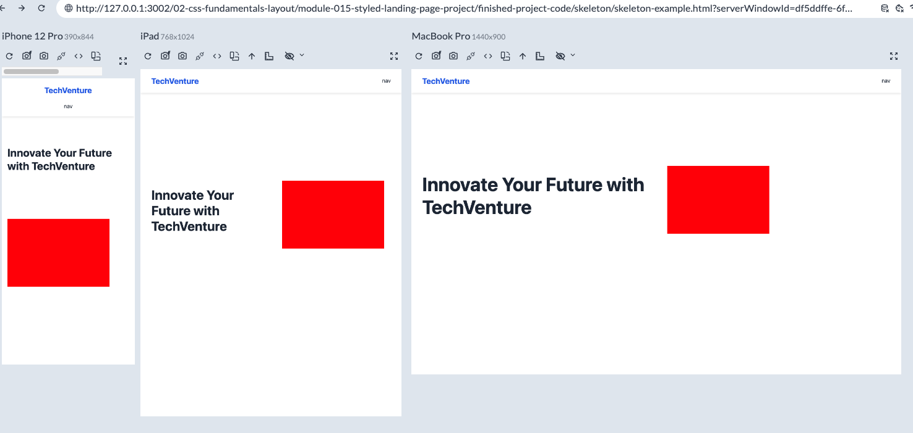
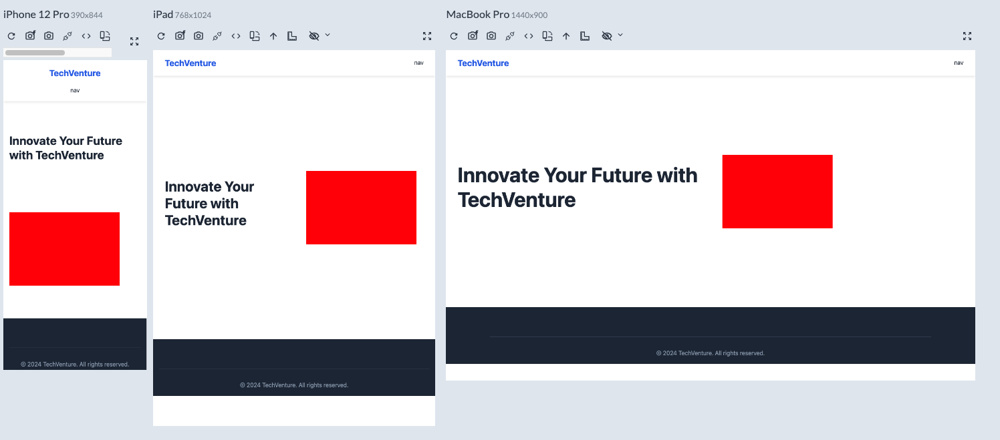

# Plan

1. Slice up the image(or your mock up) (desktop or mobile) and determine the general structure
2. Create the starter for desktop/tablet/mobile
   - create the html file first - index.html
   - ! + tab to use the template
   - create stylesheet
   - link tag added to header
   - add the stylesheet to link tag
3. Begin with Basic html structure(skeleton) and css with media queries ( <768px mobile, 768 to 1024px for tablet)
   - in your css file add the desktop rules first
   - add the tablet media query
   - add the mobile media query
4. Adding the header ->
   - desktop css
   - tablet css
   - mobile css
5. Add the nav/logo -> desktop > tablet> mobile
   
6. Add a main blank section -> desktop > tablet> mobile
   - (flex box roughed out - to change it from row column on the media queries)
   - (very little text - no images)
     
7. Add a footer with some text in there -> desktop > tablet> mobile

- your skeleton should similar
  

8. After skeleton start at the main section and start filling the rest in
