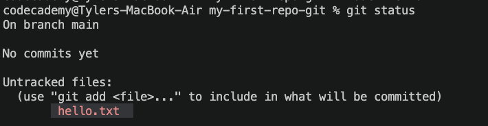
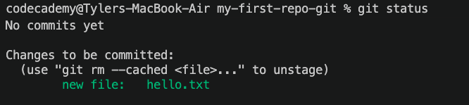

# My First Repo — Git Terminal Edition

> Uses the command line directly

---

## Create a repo

### Step 0 — Choose where your repo will live

- Open a terminal and navigate to your folder
- Confirm your location with `pwd`
- Or right-click a folder in VS Code → *Open in Integrated Terminal*

### Step 1 — Initialize the repo

```bash
git init
```

### Step 2 — Confirm it worked

A hidden `.git` folder is created — that's the repo.

> **Can't see it?** Run `ls -a` to show hidden files.

---

## Add files and commit

### Step 1 — Create a new file

```bash
touch hello.txt
```

### Step 2 — Add content and save

Add "Hello World" to the file and save.

### Step 3 — Check repo status

```bash
git status
```



### Step 4 — Stage the file

```bash
git add hello.txt
```

### Step 5 — Check status again

The file is now staged.

```bash
git status
```



### Step 6 — Commit the staged file

```bash
git commit -m "added hello.txt"
```


### Step 7 — Check status one more time

Working tree is clean.

```bash
git status
```

