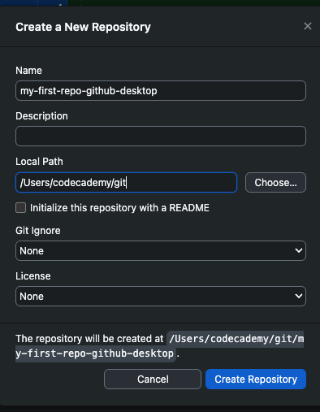
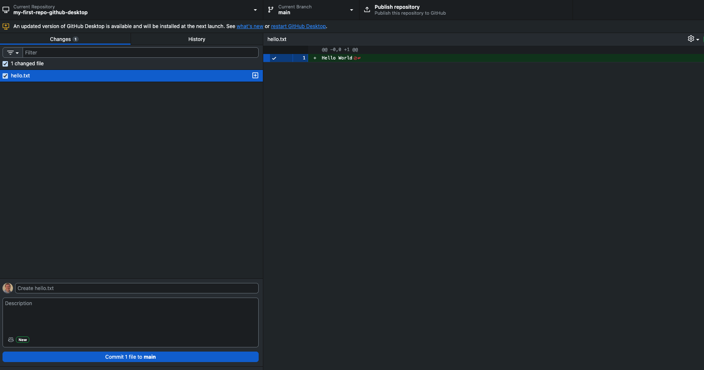
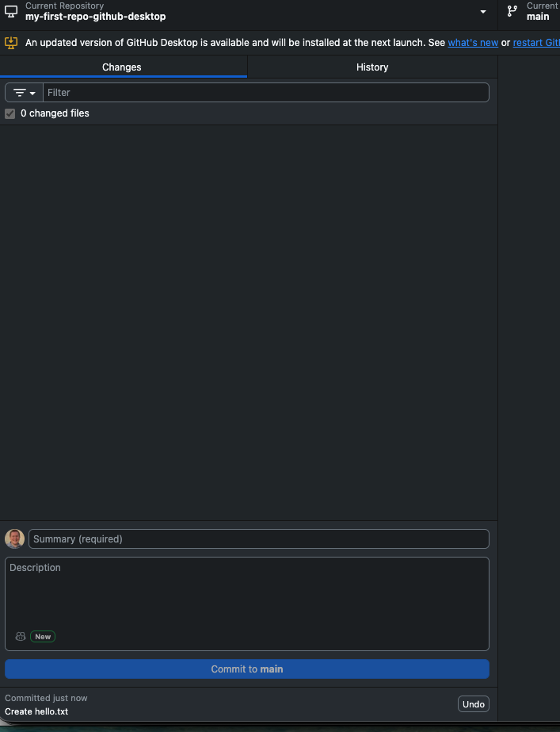

# My First Repo — GitHub Desktop Edition

> Uses the GitHub Desktop GUI

---

## Create a repo

### Step 0 — Choose where your repo will live

- In Explorer (Windows) or Finder (Mac), create a new folder
- Note the folder path for the next step

### Step 1 — Initialize the repo in GitHub Desktop

- Open GitHub Desktop
- Go to *File → New Repository*
- Fill in the details and set the local path

- Click *Create Repository*

### Step 2 — Confirm it worked

A hidden `.git` folder is created — that's the repo.

> **Can't see it?** Look up how to show hidden files for your OS.

---

## Add files and commit

### Step 1 — Create a new file

- In GitHub Desktop, click *Open in Visual Studio Code*
- Create a new file called `hello.txt`

### Step 2 — Add content and save

Add "Hello World" to the file and save.

### Step 3 — Check repo status

Look at the Changes tab in GitHub Desktop.

### Steps 4–5 — Review staged files

Files are staged automatically — review them in the Changes tab.

> Uncheck any files you don't want to include in this commit.

### Step 6 — Commit the changes

- **Option A** — Click Commit with the default summary message
- **Option B** — Edit the summary first, then click Commit

### Step 7 — Check status one more time

The Changes tab is now empty.

