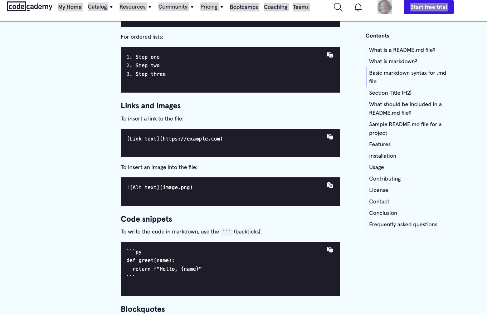
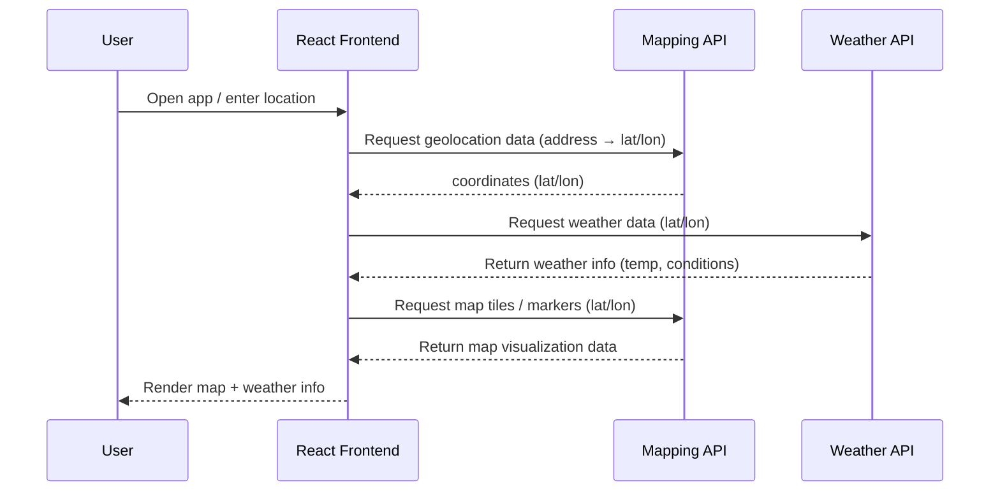

<!-- headings equivalent in html -->
<!-- h1-h4 -->

<!-- Would you rather have -->
<!-- <h1>h1</h1> -->
# H1

## H2

### H3

#### H4

<!-- Lists -->
<!-- ordered list <ol><li></li></ol> -->

1. Milk
2. Cookies
3. Ice Cream

<!-- unordered list <ul><li></li></ul>  -->
- item
  - subitem

<!-- anchor tag / href link <a href="<url>"></a> -->

[Google](https://google.com)

<!-- img tag - "/> -->



<!-- alternatively -->
<!--  -->

<!-- code snippets - <pre><code>code here</code></pre> -->

<!-- a code snippet without the language definition
 -->

 ```
 <!DOCTYPE>
 <html>
 </html>
 ```

 <!-- html defined the language -->

```html
<!DOCTYPE >
<html>
</html>
```

<!-- js defined the language -->

```javascript
let time = 1;
```

<!-- quotes - <quote>Quote Here</quote> -->

> Say something profound here


<!-- horizontal rule - <hr /> -->

---

<!-- checkbox  <input type="checkbox"> -->

- [ ] This is the checkbox
- [x] This is a checked box


<!-- Bonus Mermaid Diagrams -->
<!-- You ask AI to create these from your projects or from concepts -->

<!--  Example promt -->
<!--  Create a mermaid diagram <optionally the type here> for <concept> -->

<!-- Create a mermaid sequence diagram for calling a weather API and a mapping api from a react front end  -->


