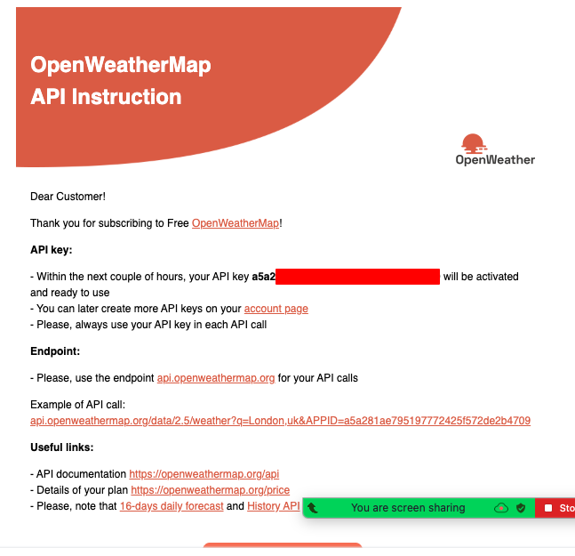
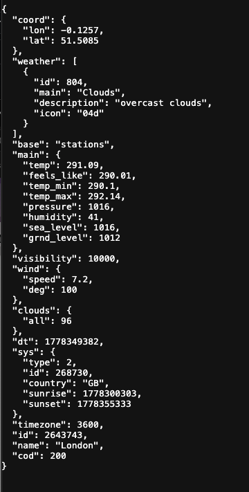
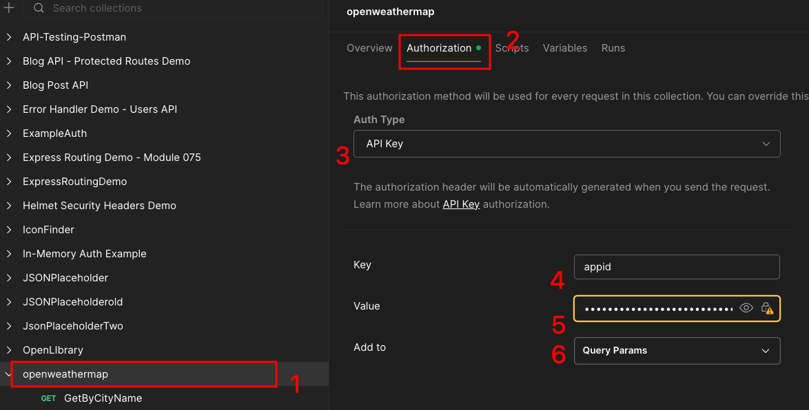

# API Key Quick Guide: Real-World Example

## What is an API Key?

An API key is like a password that identifies you when making requests to an API. It helps the API provider track usage and prevent abuse.

---

## Step-by-Step: Using the OpenWeather API

We'll use OpenWeather API because it's free, beginner-friendly, and widely used in real applications.

### Step 1: Sign Up for an API Key

1. Go to [https://openweathermap.org/price](https://openweathermap.org/price)
2. Click "Sign Up" in the top right corner
3. Fill out the registration form with your email
4. Check your email and verify your account
5. Once logged in, go to "API keys" tab
6. Copy your API key (it looks like: `a1b2c3d4e5f6g7h8i9j0k1l2m3n4o5p6`)

**Important:** It may take 10-15 minutes for your API key to activate after signup.

You may get an email that looks like this:

- 

---

### Step 2: Test Your API Key in the Browser/Postman

#### Browser

Before writing code, test if your API key works:

1. Open a new browser tab
2. Paste this URL (replace `YOUR_API_KEY` with your actual key):

```
https://api.openweathermap.org/data/2.5/weather?q=London&appid=YOUR_API_KEY
```

3. You should see JSON data about London's weather similar to

- 

4. If you see an error, wait a few minutes for your key to activate

#### Postman Setup

1. Create a new collection
2. Click on the collection and and set it up as you see here:
   - 1a. click on the collection
   - 2b. click on the Authorization tab
   - 3c. change "Auth type" to API key
   - 4d. add the "Key" as "appid"
   - 5e. update the value as your API key you got
   - 6f. Add to: "Query Params"
     
3. Create a new request and name it GetByCity

- Change the request GET and the url to "https://api.openweathermap.org/data/2.5/weather?q=London"

4. Send to test the request. If it works hit Save

---

### Step 3: Use the API Key in JavaScript

Here's how to make a request with your API key:

```javascript
// Store your API key in a variable
const apiKey = "a1b2c3d4e5f6g7h8i9j0k1l2m3n4o5p6";

// Build the API URL with your key
const city = "New York";
const apiUrl = `https://api.openweathermap.org/data/2.5/weather?q=${city}&appid=${apiKey}`;

// Make the request
fetch(apiUrl)
  .then((response) => response.json())
  .then((data) => {
    console.log("Weather Data:", data);
    console.log("Temperature:", data.main.temp);
    console.log("Description:", data.weather[0].description);
  })
  .catch((error) => {
    console.error("Error fetching weather:", error);
  });
```

---

### Step 4: Add Units to Get Readable Temperature

By default, temperature is in Kelvin. Add `units=metric` for Celsius or `units=imperial` for Fahrenheit:

```javascript
const apiKey = "YOUR_API_KEY";
const city = "Los Angeles";

// Add &units=imperial for Fahrenheit
const apiUrl = `https://api.openweathermap.org/data/2.5/weather?q=${city}&appid=${apiKey}&units=imperial`;

fetch(apiUrl)
  .then((response) => response.json())
  .then((data) => {
    const temperature = data.main.temp;
    const description = data.weather[0].description;

    console.log(`The temperature in ${city} is ${temperature}°F`);
    console.log(`Current conditions: ${description}`);
  })
  .catch((error) => {
    console.error("Error:", error);
  });
```

---

### Step 5: Handle User Input

Let users search for any city:

```javascript
const apiKey = "YOUR_API_KEY";

// Get the city from user input
const cityInput = document.querySelector("#city-input");
const searchButton = document.querySelector("#search-button");
const resultDiv = document.querySelector("#result");

searchButton.addEventListener("click", function () {
  const city = cityInput.value;

  // Build URL with user's city
  const apiUrl = `https://api.openweathermap.org/data/2.5/weather?q=${city}&appid=${apiKey}&units=imperial`;

  fetch(apiUrl)
    .then((response) => {
      // Check if the city was found
      if (!response.ok) {
        throw new Error("City not found");
      }
      return response.json();
    })
    .then((data) => {
      // Display the weather data
      const temperature = data.main.temp;
      const description = data.weather[0].description;

      resultDiv.textContent = `${city}: ${temperature}°F, ${description}`;
    })
    .catch((error) => {
      resultDiv.textContent = "Error: Could not find that city";
      console.error("Error:", error);
    });
});
```

---

## Common API Key Mistakes

### 1. Exposing Your Key in Public Code

**Bad:**

```javascript
// Never commit API keys to GitHub
const apiKey = "a1b2c3d4e5f6g7h8i9j0k1l2m3n4o5p6";
```

**Better (for learning):**

```javascript
// For learning projects, this is okay
// For real projects, use environment variables
const apiKey = "YOUR_API_KEY";
```

**Best (for production):**

```javascript
// Use environment variables (requires a backend)
const apiKey = process.env.WEATHER_API_KEY;
```

### 2. Forgetting the API Key Parameter

**Wrong:**

```javascript
// Missing the appid parameter
const url = "https://api.openweathermap.org/data/2.5/weather?q=Paris";
```

**Correct:**

```javascript
// Always include appid=YOUR_KEY
const url = `https://api.openweathermap.org/data/2.5/weather?q=Paris&appid=${apiKey}`;
```

### 3. Not Checking Response Status

**Bad:**

```javascript
fetch(apiUrl)
  .then((response) => response.json())
  .then((data) => console.log(data));
```

**Good:**

```javascript
fetch(apiUrl)
  .then((response) => {
    if (!response.ok) {
      throw new Error(`API Error: ${response.status}`);
    }
    return response.json();
  })
  .then((data) => console.log(data))
  .catch((error) => console.error("Error:", error));
```

---

## Understanding API Key URL Structure

Here's how the URL breaks down:

```
https://api.openweathermap.org/data/2.5/weather?q=Boston&appid=YOUR_KEY&units=imperial
│                                              │       │            │
│                                              │       │            └─ Additional parameters
│                                              │       └─ Your API key (required)
│                                              └─ Query parameters start with ?
└─ Base API endpoint
```

**Parts of the URL:**

- `?` - Starts the query parameters
- `q=Boston` - The city parameter
- `&` - Separates multiple parameters
- `appid=YOUR_KEY` - Your API key parameter
- `&units=imperial` - Optional unit parameter

---

## Other Free APIs to Try

Once you understand API keys with OpenWeather, try these:

1. **NASA API** - Space photos and data
   - Sign up: [https://api.nasa.gov](https://api.nasa.gov)
   - Example: `https://api.nasa.gov/planetary/apod?api_key=YOUR_KEY`

2. **NewsAPI** - News headlines
   - Sign up: [https://newsapi.org](https://newsapi.org)
   - Example: `https://newsapi.org/v2/top-headlines?country=us&apiKey=YOUR_KEY`

3. **The Movie Database (TMDB)** - Movie information
   - Sign up: [https://www.themoviedb.org/settings/api](https://www.themoviedb.org/settings/api)
   - Example: `https://api.themoviedb.org/3/movie/popular?api_key=YOUR_KEY`

---

## Quick Reference

### Basic Fetch with API Key

```javascript
const apiKey = "YOUR_API_KEY";
const apiUrl = `https://api.example.com/data?apiKey=${apiKey}`;

fetch(apiUrl)
  .then((response) => response.json())
  .then((data) => console.log(data))
  .catch((error) => console.error("Error:", error));
```

### Complete Weather App Example

```html
<!DOCTYPE html>
<html>
  <head>
    <title>Weather App</title>
  </head>
  <body>
    <h1>Weather Search</h1>
    <input type="text" id="city-input" placeholder="Enter city name" />
    <button id="search-button">Get Weather</button>
    <div id="result"></div>

    <script>
      const apiKey = "YOUR_API_KEY";
      const searchButton = document.querySelector("#search-button");
      const cityInput = document.querySelector("#city-input");
      const resultDiv = document.querySelector("#result");

      searchButton.addEventListener("click", function () {
        const city = cityInput.value;
        const apiUrl = `https://api.openweathermap.org/data/2.5/weather?q=${city}&appid=${apiKey}&units=imperial`;

        fetch(apiUrl)
          .then((response) => {
            if (!response.ok) {
              throw new Error("City not found");
            }
            return response.json();
          })
          .then((data) => {
            const temp = data.main.temp;
            const description = data.weather[0].description;
            resultDiv.textContent = `${city}: ${temp}°F, ${description}`;
          })
          .catch((error) => {
            resultDiv.textContent = "Error: Could not find that city";
          });
      });
    </script>
  </body>
</html>
```

---

## Tips for Working with APIs

1. **Read the Documentation** - Every API has different requirements
2. **Check Rate Limits** - Free tiers usually limit requests per minute/day
3. **Test in Browser First** - Verify your API key works before writing code
4. **Handle Errors** - Always use `.catch()` to handle network errors
5. **Never Share Your Key** - Keep API keys private and secure

---

## Next Steps

1. Sign up for OpenWeather API and get your key
2. Test the key in your browser
3. Build the simple weather app above
4. Add features like:
   - 5-day forecast
   - Weather icons
   - Temperature conversion
   - Save favorite cities
