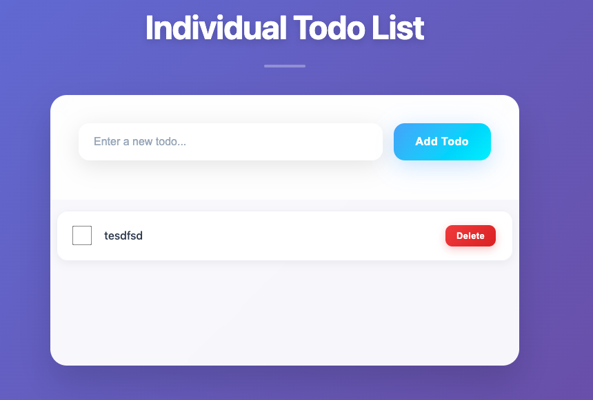
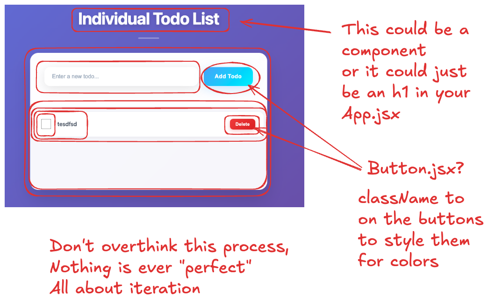

## Todo in React Application

0. Create a todo app repo:
   - You do not need to add the plan or rubric to this repo
   - Start with a blank repo on Github, clone it locally, and then do step 2 from this directory
1. Review Todo App created in Week 7 Session 3
   - Take a look at the rendered page
   - Click through the interactions (Delete, adding todos, completing todos, any extra functionality if any)
2. Use the vite application template to start up a new react app (from the github repo root you created):

   ```bash
   npm create vite@latest todo-react-app -- --template react
   ```

   Install with npm and start now?
   - Yes

   #### Note if this doesn't work and you get a different selection like:
   1. "Select a framework"
      - "React"
   2. "Select a variant"
      - "JavaScript"

   #### Update the following files:

   App.jsx

   ```javascript
   import "./App.css";

   function App() {
     return (
       <>
         <h1>Starting Here</h1>
       </>
     );
   }

   export default App;
   ```

   App.css

   ```
   /* Component styles here */

   h1 {
   color: blue;
   }
   ```

   Index.css

   ```
   /* Global styles here */
   ```

   Then you will commit your inital commit to your repo

3. We can organize our application a little more with folders:

- Underneath the src folder add
  - components folder
  - Note: in the future we will add - pages folder - we will use this when we get to React Router and having multiple "pages" in our SPA
  - Note: make sure when you import to use the new folder structure
    ```javascript
    import YourComponent from "./components/YourComponent";
    ```

4. Slice up page to understand components

- Start with a screenshot of the finished page
- With other projects you will use wireframes/mockups and do something similar



- Then start slicing up the image into components with names
- Ask yourself:
  - Will this component be maintainable (is it doing too much)
  - Will this ever be reused?
    - You probably dont need a special <h1> component to display the
      title of the todo app
  - Is this a Display or Logic based components
    - Display components might just be inputs
    - Logic components might be the one that adds a todo to your list or removes it
- You should have at least (TodoList, TodoItem, AddTodo)



5. Add components one by one
   - Start with display components first (inputs, buttons etc)
   - Then you can use those in your larger components
   - Refer back to the todo dom project for styles

6. Test as you go. Commit each time you have a small working feature
