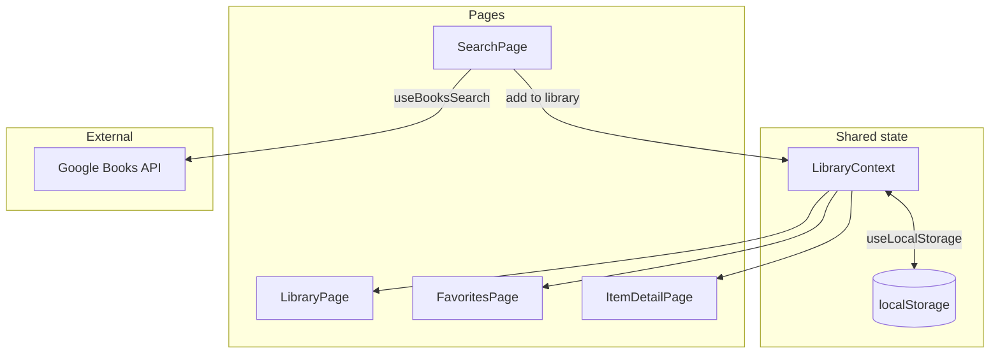

# Personal Library App — Project Summary (Teacher Communication)

**Last updated:** May 28, 2026  
**Course:** FS12 Week 10 Session 3 — Major Project 3  
**Option chosen:** Option A — Personal Library App (not Mini Game)  
**Submission:** [github.com/QABrandon/personal-library](https://github.com/QABrandon/personal-library)  
**Portfolio demo:** [full-stack-2026/portfolio/major-03-personal-library/dist/](https://github.com/QABrandon/full-stack-2026/tree/main/portfolio/major-03-personal-library/dist)

This document summarizes what was built, how it maps to the rubric and plan, and **why** key decisions were made — for instructor review, `#project-showcase`, or oral defense.

Related cohort files: `OPTION-A-PERSONAL-LIBRARY-APP-PLAN.md`, `react-state-management-project-rubric-v2.md`.

---

## Executive summary

The Personal Library is a **React + Vite** multi-page app for searching books via the **Google Books API**, saving titles to a personal collection, and managing **reading status**, **favorites**, **notes**, and **ratings**. State is shared with **Context API** and **custom hooks**; the library persists in **localStorage**. **React Router** drives at least four routes (Library, Search, Favorites, Item detail, plus 404).

The project demonstrates Week 10 learning goals: `useState`, `useEffect`, immutable updates, side effects for API calls, lifted/shared state, and optional Context patterns from the rubric bonus list.

---

## Where the code lives

| Location | Role |
| --- | --- |
| [github.com/QABrandon/personal-library](https://github.com/QABrandon/personal-library) (`personal-library-app/`) | **Class submission** — source, commits, README, local dev |
| `portfolio/major-03-personal-library/dist/` in [full-stack-2026](https://github.com/QABrandon/full-stack-2026) | **Portfolio only** — built static output for the site card (no duplicate React source) |

**Why two locations:** The rubric requires a clean GitHub repo for grading. The portfolio site needs a stable `dist/` path under `/portfolio/major-03-personal-library/dist/` without copying the entire Vite project into the showcase repo. Source stays canonical in `personal-library`; the portfolio folder is refreshed with `npm run build` + `rsync` when the demo needs updating.

---

## Why Option A (Personal Library)

- Aligns with **API integration + CRUD + filtering** requirements in the rubric’s Option A checklist.
- Builds directly on **Week 10 Session 1–2** material: `useEffect`, Context, custom hooks, and React Router — same patterns the plan expects in `src/context/`, `src/hooks/`, and `src/pages/`.
- Option B (Mini Game) would satisfy the rubric but would emphasize game state over library/search UX; Option A was a better fit for practicing **external API fetch**, **persistent user data**, and **multi-route information architecture**.

---

## Why Google Books (no API key)

The plan recommends Google Books. The app uses the public `https://www.googleapis.com/books/v1/volumes?q=` endpoint so classmates and graders can run the project without key setup. Responses are normalized in `mapGoogleBook.js` into the app’s item shape (title, author, thumbnail, description, etc.).

**Tradeoff acknowledged:** Rate limits exist on the free tier; for class-scale usage and demos this is acceptable. A production app would add caching or a backend proxy.

---

## Build phases (commit history)

Each phase matches a dated commit in the submission repo — incremental work, not a single dump.

### Phase 1 — Initialize Vite + React (`2026-05-29`)

**What:** `npm create vite`, dependencies, folder scaffold under `personal-library-app/`.

**Why:** Establishes the toolchain before feature work, same pattern as other React projects in the cohort.

---

### Phase 2 — App shell and routes (`2026-05-30`)

**What:** `App.jsx` with `BrowserRouter`, route table, `AppShell`, header/nav, placeholder pages, design tokens in CSS.

**Why:** Router and layout come first so every later feature has a clear home (Library, Search, Favorites, Details, NotFound). Matches plan Step 3 (React Router setup).

---

### Phase 3 — LibraryContext and CRUD (`2026-06-01`)

**What:** `LibraryContext.jsx`, `useLibrary.js`, `libraryActions.js` — add, update, remove, toggle favorite, status changes with **immutable** array/object updates.

**Why:** Central source of truth for library data; satisfies rubric **state lifting**, **immutable updates**, and Option A **CRUD** requirements.

---

### Phase 4 — localStorage persistence (`2026-06-02`)

**What:** `useLocalStorage.js` hook; library hydrates on load and saves on change.

**Why:** Required rubric item; users expect data to survive refresh without a backend.

---

### Phase 5 — Google Books search (`2026-06-03`)

**What:** `useBooksSearch.js`, `SearchPage`, `SearchForm`, `SearchResults`, loading/error/empty UI, debounced query via `useDebouncedValue.js`.

**Why:** Required **API integration** and **useEffect** side effects; debouncing avoids hammering the API on every keystroke.

---

### Phase 6 — Favorites and item detail (`2026-06-04`)

**What:** `FavoritesPage`, `ItemDetailPage` with `useParams`, notes/rating on detail view, `LibraryBookCard`, `ConfirmDialog` for delete.

**Why:** Option A **favorites** and **detail view** requirements; dynamic route proves Router beyond static pages.

---

### Phase 7 — Filter, sort, edit (`2026-06-05`)

**What:** `LibraryToolbar`, filter by status/favorites, sort options, inline edit flows on Library page.

**Why:** Option A **advanced filtering/sorting**; keeps filtering logic derived from context state rather than duplicated copies.

---

### Phase 8 — Responsive layout and polish (`2026-06-08`)

**What:** Layout CSS, empty states, stat counters, accessibility patterns (skip link, landmarks, focus styles, live regions).

**Why:** Usable demo for portfolio and graders; WCAG-minded patterns support real users and show intentional UX, not just rubric minimum.

---

### Phase 9 — README and portfolio workflow (`2026-06-10` – `2026-06-11`)

**What:** Submission README (setup, features, API, a11y notes); portfolio sync docs; hub link back to site home; removed unused Vite scaffold assets.

**Why:** Rubric **README documentation**; portfolio integration documented so the showcase build stays in sync without duplicating source.

---

## Bonus features (beyond “Must Have”)

| Feature | Reason |
| --- | --- |
| **ThemeContext** (dark mode) | Rubric bonus — app-wide preferences via Context |
| **ErrorBoundary** | Rubric bonus — graceful failure on render errors |
| **Search history** (localStorage) | Improves repeat searches; small `useEffect` + persistence exercise |
| **Export library JSON** | User-owned data export; no backend required |
| **React.lazy** route chunks | Smaller initial bundle; optional performance pattern |
| **Accessibility** | Skip link, `aria-live`, keyboard dialogs, token contrast — defensible quality bar for a portfolio piece |

Live deploy URL is still pending in README; local + portfolio `dist/` demo are available for review.

---

## Rubric alignment (high level)

| Rubric area | How it is met |
| --- | --- |
| useState / useEffect | Search input, library list, loading/error, persistence effects |
| Custom hooks | `useLocalStorage`, `useLibrary`, `useBooksSearch`, `useDebouncedValue`, `useRouteFocus` |
| Immutable updates | `libraryActions.js` — spread/map/filter throughout |
| API integration | Google Books search flow |
| React Router | 5 routes including 404 |
| localStorage | Library (+ search history, theme preference) |
| Error handling | try/catch in fetch, user-facing messages, ErrorBoundary |
| Option A CRUD / favorites / status / filter | Library + Search + Favorites + Detail pages |
| Clean repo + README | Milestone-style commits; README in submission repo |

---

## Architecture (how pieces connect)



**Rule:** Pages and components **consume** context via `useLibrary()`; they do not each maintain their own copy of the library array.

---

## Key files (submission repo)

| Path | Purpose |
| --- | --- |
| `src/App.jsx` | Routes, providers, lazy-loaded pages |
| `src/context/LibraryContext.jsx` | Library state + dispatch helpers |
| `src/context/ThemeContext.jsx` | Dark/light theme |
| `src/hooks/useLocalStorage.js` | Generic persistence hook |
| `src/hooks/useLibrary.js` | Context consumer wrapper |
| `src/hooks/useBooksSearch.js` | Google Books fetch + status |
| `src/utils/libraryActions.js` | Immutable CRUD helpers |
| `src/utils/mapGoogleBook.js` | API → app item shape |
| `src/pages/*.jsx` | One page per major route |

---

## How to verify

```bash
git clone https://github.com/QABrandon/personal-library.git
cd personal-library/personal-library-app
npm install
npm run dev
```

**Suggested demo path for instructor:** Search → add a book → Library (filter/sort) → Favorite → open Detail (notes/status) → refresh page (persistence) → Favorites view.

---

## Talking points for instructor questions

1. **Why Context instead of only prop drilling?** Library data is needed on Library, Favorites, Detail, and Search (add flow). Context avoids passing the same props through many layers.
2. **Why immutable updates?** React detects changes by reference; mutating arrays in place causes subtle bugs and fails the rubric’s explicit requirement.
3. **Why separate submission repo and portfolio `dist/`?** Keeps the class repo focused on source; portfolio only hosts the built demo path the site expects.
4. **Why books only (not movies)?** Google Books is keyless and matches the plan’s recommended API; scope stayed manageable for one major project week.
