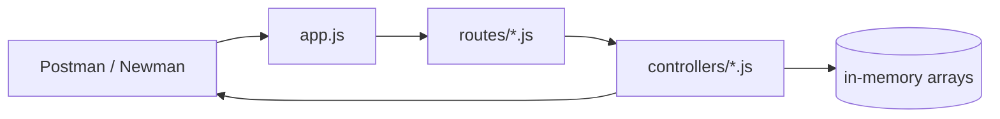

# Blog Post API — Project Summary (Teacher Communication)

**Last updated:** May 28, 2026  
**Course:** FS12 Week 11 Session 3 — Express API Project  
**Setup path:** **Option A — Start from Scratch** (not Option B template copy)  
**Submission:** [github.com/QABrandon/blog-post-api](https://github.com/QABrandon/blog-post-api)  
**Local original:** `~/Desktop/BM Work/My Projects/FS Bootcamp/blog-post-api/`  
**Due date (rubric):** June 6

This document summarizes what was built, how it maps to the rubric and plan, and **why** key decisions were made — for instructor review, `#project-showcase`, or oral defense.

Related cohort files: `express-api-project-PLAN.md`, `express-api-project-rubric.md`, `complete-example/` (reference only; Postman collection source).

**No frontend** — per rubric, the API is exercised with Postman or Newman only.

---

## Executive summary

The Blog Post API is an **Express.js REST API** with two resources:

- **Posts** — `id`, `title`, `content`, `author`, `published`, `createdAt`
- **Users** — `id`, `name`, `email`, `role`, `createdAt`

It implements full **CRUD** at `/api/posts` and `/api/users`, uses **MVC** (routes → controllers), **in-memory storage**, **validation**, **error middleware**, and correct **HTTP status codes** (200, 201, 400, 404, 500). JSON **documentation** is served at `GET /`; **health** at `GET /health`.

Automated tests: **17 Newman requests, 39 assertions** — all passing when the server is running.

---

## Where the code lives

| Location | Role |
| --- | --- |
| `~/Desktop/BM Work/My Projects/FS Bootcamp/blog-post-api/` | **Local original** — source, Newman tests, README |
| [github.com/QABrandon/blog-post-api](https://github.com/QABrandon/blog-post-api) | **Remote submission** — push target for `#project-showcase` |
| [full-stack-2026](https://github.com/QABrandon/full-stack-2026) portfolio card | **GitHub link only** — no on-site demo (API tested via Postman/Newman) |

---

## Why Option A (Start from Scratch)

The plan offers:

- **Option A:** `npm init`, install deps, create folders, implement each file yourself; copy only the Postman collection from `complete-example/`.
- **Option B:** Copy entire `complete-example/*`, delete implementation code, fill in yourself.

**Option A was chosen** to work through Express setup, routing, and controllers step by step — same learning path the plan recommends for “full learning.” The Postman collection was copied from cohort materials as Option A instructs; implementation code was written to match the plan checklist, not pasted from the template folder.

---

## Why no frontend

The rubric states explicitly: *“Do not make a frontend for this, you will interact with this api via Postman.”* Documentation is JSON at `GET /` when the server runs locally. A separate portfolio overview page was removed so submission and grading stay API-focused.

---

## Build phases (commit history)

Commits are dated **May 21–28, 2026**, one logical step per day, matching the plan’s implementation order.

### Phase 1 — Project init (`2026-05-21`)

**What:** `package.json`, `package-lock.json`, `.gitignore`; `express`, `nodemon`, `newman` scripts.

**Why:** Plan Option A steps 1–3 — prove dependencies and npm scripts before writing routes.

---

### Phase 2 — Posts controller (`2026-05-22`)

**What:** `controllers/postsController.js` — `getAllPosts`, `getPostById`, `createPost`, `updatePost`, `deletePost`; validation (title min 3 chars, content min 10, required author); in-memory seed data.

**Why:** Plan Step 2 — one resource at a time; posts are the primary domain model in the assignment narrative.

---

### Phase 3 — Users controller (`2026-05-23`)

**What:** `controllers/usersController.js` — full CRUD; email format check; role enum (`admin` \| `author` \| `reader`).

**Why:** Plan Step 3 — second resource with its own validation rules.

---

### Phase 4 — Routes (`2026-05-24`)

**What:** `routes/posts.js`, `routes/users.js` — Express Router wired to controller methods.

**Why:** Plan Steps 4–5 — routes handle HTTP mapping only; business logic stays in controllers (separation of concerns / MVC).

---

### Phase 5 — Main application (`2026-05-25`)

**What:** `app.js` — `express.json()`, mount `/api/posts` and `/api/users`, `GET /` API docs JSON, `GET /health`, 404 catch-all, startup logs.

**Why:** Plan Step 1 checklist — central entry point after controllers and routes exist so imports resolve cleanly.

---

### Phase 6 — Middleware (`2026-05-26`)

**What:** `middleware/errorHandler.js`, `middleware/requestLogger.js`; registered in `app.js` (logger before routes, error handler last).

**Why:** Plan Step 6 + rubric **error handling**; request logging covers rubric bonus **logging / custom middleware**.

**Note:** The cohort `complete-example` inlines logging in `app.js`; extracting `requestLogger.js` keeps `app.js` readable while meeting the same behavior — small structural choice, not a different feature set.

---

### Phase 7 — Postman / Newman (`2026-05-27`)

**What:** `Blog-Post-API.postman_collection.json`; `npm test` runs Newman.

**Why:** Plan testing section + rubric **endpoint testing** — proves all 10 CRUD endpoints, validation errors, and 404s.

---

### Phase 8 — Documentation (`2026-05-28`)

**What:** `README.md`, `.env.example`; package name `blog-post-api`.

**Why:** Rubric submission and onboarding — clone, install, dev, test without reading every file.

---

## Project structure (final)

```
blog-post-api/
├── app.js
├── package.json
├── Blog-Post-API.postman_collection.json
├── controllers/
│   ├── postsController.js
│   └── usersController.js
├── routes/
│   ├── posts.js
│   └── users.js
└── middleware/
    ├── errorHandler.js
    └── requestLogger.js
```

Matches rubric **file organization** and plan **Project Structure** section.

---

## Rubric alignment (high level)

| Rubric area | How it is met |
| --- | --- |
| Express setup + PORT from env | `app.js`, `.env.example` |
| Posts CRUD `/api/posts` | 5 endpoints, controller + routes |
| Users CRUD `/api/users` | 5 endpoints, controller + routes |
| Express Router in separate files | `routes/posts.js`, `routes/users.js` |
| Controllers with named CRUD functions | Both controller files |
| `express.json()` | Registered in `app.js` |
| In-memory storage + required fields | Arrays in controllers |
| Validation | Create/update handlers return 400 |
| Error middleware + status codes | `errorHandler.js`, 404 handler |
| Postman testing | Newman 39/39 assertions |
| No frontend | API + Postman only |

---

## Request flow (MVC)



Errors bubble to `errorHandler`; unknown routes hit the `*` handler before that.

---

## How to verify

```bash
cd ~/Desktop/BM\ Work/My\ Projects/FS\ Bootcamp/blog-post-api
npm install
npm run dev          # terminal 1 — http://localhost:3000
npm test             # terminal 2 — Newman collection
```

Or clone fresh:

```bash
git clone https://github.com/QABrandon/blog-post-api.git
cd blog-post-api
npm install
npm run dev          # terminal 1
npm test             # terminal 2
```

Optional manual check: import `Blog-Post-API.postman_collection.json` in Postman with `baseUrl` = `http://localhost:3000`.

---

## Talking points for instructor questions

1. **Why in-memory storage?** Assignment spec; keeps focus on Express patterns without database setup. Data resets on server restart — acceptable for this rubric.
2. **Why two resources?** Rubric requires both posts and users CRUD to practice REST routing and controller patterns twice with different validation rules.
3. **Why JSON at `GET /` instead of a docs site?** Satisfies “documentation” without a frontend; browser or Postman can read the endpoint map and body schemas.
4. **Why Option A over copying the template?** Intentional practice building each layer; only the test collection was reused from cohort files, as the plan allows.
5. **Why incremental commits?** Reflects the plan’s advice to implement and test one endpoint/area at a time rather than one monolithic upload.

---

## HTTP status codes (quick reference)

| Code | Usage |
| --- | --- |
| 200 | Successful GET, PUT, DELETE |
| 201 | Successful POST (resource created) |
| 400 | Validation failure (missing/invalid body) |
| 404 | Post/user id not found, or unknown route |
| 500 | Unhandled server error (error middleware) |
