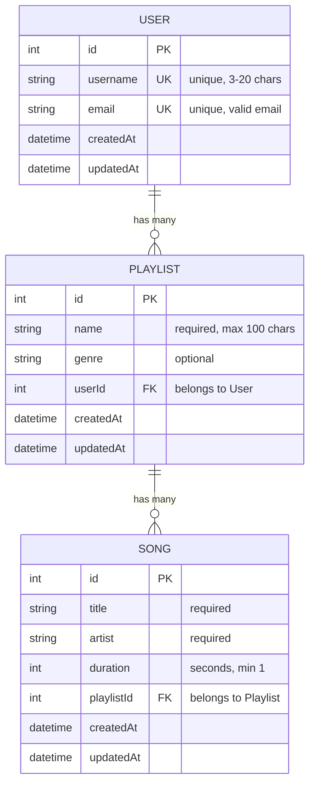

# Sequelize Code-Along: Music Playlist API

A minimal Express + Sequelize app with **3 tables**, relationships, validations, and seed data.

## Database Diagram



## Setup

```bash
npm install
createdb playlist_app        # Mac
psql -U postgres -c "CREATE DATABASE playlist_app;"  # Windows
npm run seed
npm start
```

## Endpoints

| Method | Route | Description |
|--------|-------|-------------|
| GET | /api/users | Get all users |
| POST | /api/users | Create a user |
| GET | /api/playlists | Get all playlists (with user + songs) |
| POST | /api/playlists | Create a playlist |
| GET | /api/playlists/:id | Get one playlist (with user + songs) |
| POST | /api/playlists/:id/songs | Add a song to a playlist |
