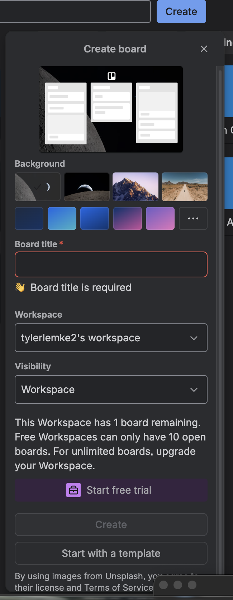
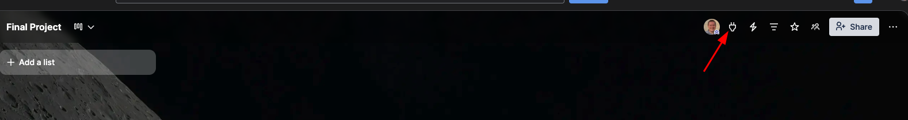
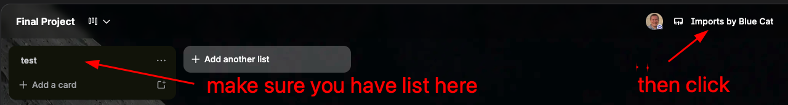
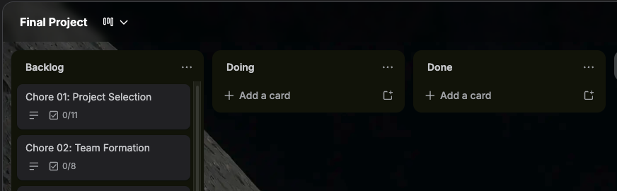

# Sprint 0 Kickoff — Start Here

## What's in this folder

This folder contains everything you need to plan and kick off your final project. Start by reading this file end-to-end, then work through the chores in [`sprint-0/`](./sprint-0/) (the source of truth for what to do):

- [`sprint-0/chores/`](./sprint-0/chores/) — chores 01–15 (project selection, user research, mockups, user stories, sprint plan, GitHub repo, React frontend, Express backend, database, deployment). Technical chores include their detailed step-by-step guides.
  - [`sprint-0/chores/templates/`](./sprint-0/chores/templates/) — user-stories and project-discovery templates referenced from the planning chores
- [`csv/`](./csv/) — Trello import files for bulk-loading the chore list
- [`images/`](./images/) — screenshots used in this guide (Trello setup flow)
- [`example-app/`](./example-app/) — reference React+Express scaffold showing what a finished Sprint 0 repo could look like
- [`using-ai-for-sprint-0.md`](./using-ai-for-sprint-0.md) — tactics and copy-paste prompts for using AI (ChatGPT, Claude) to speed through the planning chores

---

## 1. Setup Your Project Planning Tool

Choose ONE of the following options to track your Sprint 0 work:

**Option A: Trello (Recommended for beginners)**

1. Create a free Trello account at https://trello.com
2. Create a New Board
   
3. Give your board the title of Final Project or
   whatever name you want and create
4. Click on the Powerups button with your board open
   
5. Click Add Power Up button
6. Search for "Import to Trello by Blue Cat"
7. Click Add > Click Add Again
8. Accept Terms and Conditions
9. You need to create at least on list to do the import then click the imports button
   
10. Locate and follow the dialogs to import "csv/sprint-zero-trello.csv"
11. Setup your board to look like this once import is complete:
    

Reference these two files from this folder that are mentioned on the story
cards from this folder where \_start-here.md is located.

- User Stories Template: `sprint-0/chores/templates/user-stories-template.md`
- Project Idea Discovery: `sprint-0/chores/templates/project-idea-and-user-discovery.md`

**Option B: Other Project Management Software**

- Jira, Monday, Asana, ClickUp, Linear, etc.
- Manually copy the chores from the `sprint-0/chores/` folder into your chosen tool

**Option C: Manual Tracking**

- Use a pen/paper planner or a simple document
- Copy the checklists from each file in the `sprint-0/chores/` folder

## 2. Reference the Step-by-Step Guides

For the technical setup chores (11–13), use the detailed step-by-step guides for better guidance:

- **Chore 11 (GitHub Repository):** Use `sprint-0/chores/chore-11-github-repository-step-by-step.md`
- **Chore 12 (React Frontend):** Use `sprint-0/chores/chore-12-initialize-react-frontend-step-by-step.md`
- **Chore 13 (Express Backend):** Use `sprint-0/chores/chore-13-initialize-express-backend-step-by-step.md`

These step-by-step guides provide detailed terminal commands, expected outputs, and troubleshooting tips for each technical setup task.

## 3. Use AI to Move Faster

The planning chores (project selection, user stories, MVP scoping) go much faster with an AI partner. See [`using-ai-for-sprint-0.md`](./using-ai-for-sprint-0.md) for tactics that actually work and copy-paste prompts mapped to specific chores.

## 4. Important Notes

- When creating new cards during Sprint 0, use descriptive names that help you track progress
- If using a single board for all sprints, consider using labels (Sprint-0, Sprint-1, Sprint-2) to organize cards
- Reference the source files in `sprint-0/chores/` for the most up-to-date chore details
