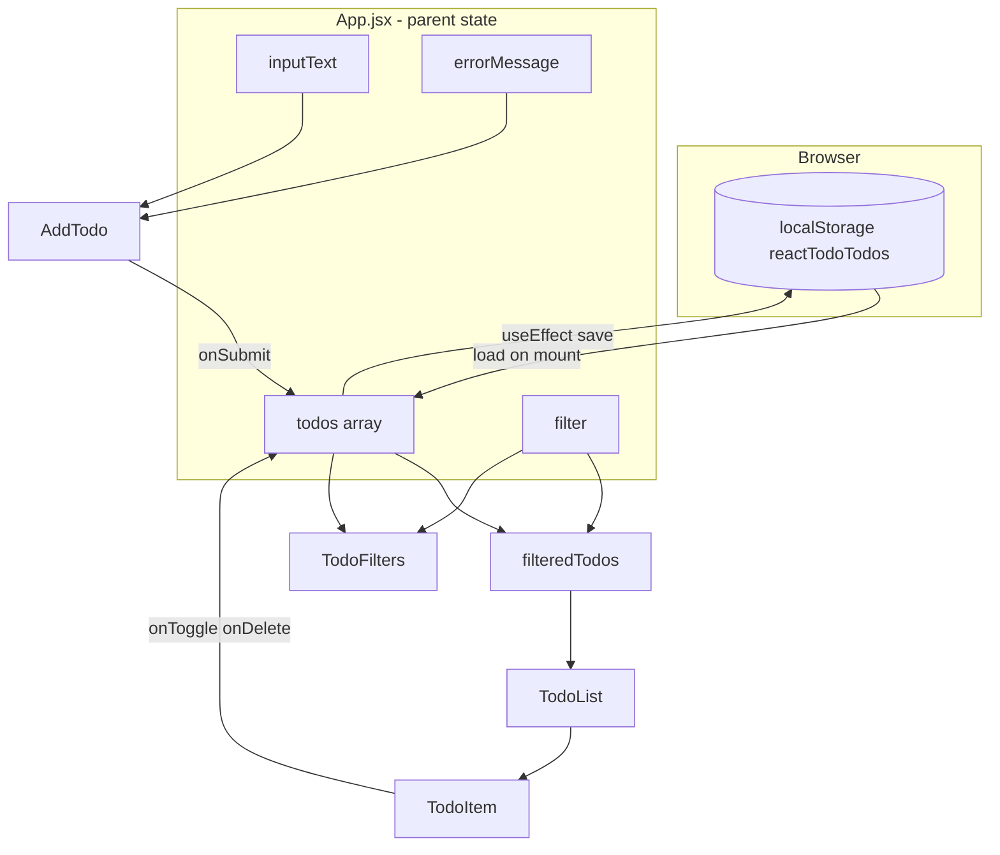

# React Todo — Phase-by-Phase Walkthrough

**Last updated:** May 28, 2026

This guide explains what was built in each commit phase of the Week 9 Session 3 React todo project, then walks through the **finished code file by file** so you can study, present, or defend the work in your own words.

## Where the code lives

| Location | Role |
|----------|------|
| `portfolio/minor-04-react-todo/` in [full-stack-2026](https://github.com/QABrandon/full-stack-2026) | Canonical source — develop and build here |
| [github.com/QABrandon/react-todo](https://github.com/QABrandon/react-todo) (`todo-react-app/`) | Class submission repo for `#project-showcase` |
| `portfolio/minor-03-todo-list-app/` | Week 7 vanilla version (behavior and design reference) |

Related session files: `plan.md`, `todo-react-project-rubric.md`, `component-slicing.png`.

---

## The eight build phases (plain English)

Each phase maps to one commit in the submission repo history.

### Phase 1 — Initialize Vite + React (`chore: initialize vite react app`)

**What you did:** Created a new React app with Vite inside `todo-react-app/`, ran `npm install`, and confirmed the dev server works.

**Why it matters:** Vite gives you fast local development and a production build. Nothing todo-specific yet — you only proved the toolchain runs.

**Typical files touched:** `package.json`, `vite.config.js`, `index.html`, `src/main.jsx`, starter `App.jsx`.

---

### Phase 2 — Component structure (`feat: add todo component structure`)

**What you did:** Added `src/components/` and created one file per UI slice:

- `AddTodo.jsx` — form area
- `TodoList.jsx` — list wrapper
- `TodoItem.jsx` — single row
- `TodoFilters.jsx` — filter buttons

**Why it matters:** You planned the UI before wiring all behavior — same idea as slicing a screenshot in `plan.md` and `component-slicing.png`.

**React idea:** Small, focused components; parent (`App`) will own data later.

---

### Phase 3 — Add todos with validation (`feat: add todos with form validation`)

**What you did:** Implemented the add flow in `App.jsx` and `AddTodo.jsx`:

- Controlled text input (`inputText` state)
- Form submit handler with `event.preventDefault()`
- Validation: trim empty input, minimum 3 characters
- Error messages shown under the form
- New todo objects pushed into the `todos` array

**Why it matters:** This is the first real feature — state lives in the parent and flows down as props.

**Todo shape in memory:**

```js
{
  id: "1734567890123",      // string from Date.now()
  text: "Buy groceries",
  completed: false,
  createdAt: "2026-05-20T19:30:00.000Z"
}
```

---

### Phase 4 — List, toggle, delete, empty states (`feat: render and manage todo list`)

**What you did:** Connected the list to live data:

- `TodoList` maps `todos` to `TodoItem` rows with `key={todo.id}`
- Checkbox toggles `completed`
- Delete button removes one todo
- Empty messages: no todos at all vs. no todos for the current filter

**Why it matters:** You practiced **lifting state** — children do not own the list; they call parent handlers (`onToggle`, `onDelete`).

---

### Phase 5 — localStorage (`feat: persist todos in local storage`)

**What you did:**

- On first load: read `reactTodoTodos` from `localStorage` (with safe JSON parsing)
- On every `todos` change: save back with `useEffect`

**Why it matters:** Data survives refresh without a backend — same user expectation as the Week 7 app.

---

### Phase 6 — Filters and counts (`feat: add active and completed filters`)

**What you did:**

- `filter` state: `"all"` | `"active"` | `"completed"`
- `filteredTodos` derived from `todos` before passing to `TodoList`
- `TodoFilters` shows counts on each button

**Why it matters:** The full list stays in memory; the UI only **displays a slice**. Counts are computed, not stored separately.

---

### Phase 7 — Styles from vanilla app (`style: port todo app layout from vanilla version`)

**What you did:** Ported layout and visual patterns from the Week 7 completed todo into `App.css` and `index.css` (spacing, header, form, list rows, filters, responsive rules).

**Why it matters:** Proves you can match an existing design while changing the implementation from DOM scripts to React.

---

### Phase 8 — README and rubric alignment (`docs: add setup and feature readme`)

**What you did:** Documented setup commands, features, folder structure, and rubric checklist in `README.md` (submission and portfolio copies).

**Why it matters:** Graders and future-you can run the project without reading every file.

---

### After the eight phases — Portfolio integration

Not a separate feature commit in the class repo, but important for your site:

1. Built with `base: /portfolio/minor-04-react-todo/dist/` in `vite.config.js` so assets load on Vercel.
2. Committed source + `dist/` under `portfolio/minor-04-react-todo/`.
3. Added Minor 04 card on root `index.html`.
4. Pushed to `full-stack-2026` so the live portfolio links work.

---

## How data flows (finished app)



**Rule to remember:** State goes **up** to `App` (one source of truth). UI pieces **down** receive props and callbacks.

---

## File-by-file guide (finished code)

Paths below refer to `portfolio/minor-04-react-todo/src/`.

### `main.jsx` — Entry point

- Imports global `index.css` and `App`.
- `createRoot(...).render()` mounts React on the `#root` div in `index.html`.
- `StrictMode` helps catch unsafe patterns in development (double-invoking some effects in dev only).

You rarely change this file after setup.

---

### `App.jsx` — Brain of the app

This file owns **all important state** and **all handlers**.

| Lines / area | Responsibility |
|--------------|----------------|
| `STORAGE_KEY`, `loadTodosFromStorage()` | Phase 5 — read saved todos safely on startup |
| `useState(() => loadTodosFromStorage())` | Lazy initial state so load runs once |
| `inputText`, `errorMessage`, `filter` | Phase 3 & 6 — form and filter UI state |
| `useEffect` on `[todos]` | Phase 5 — persist whenever the list changes |
| `handleInputChange` | Clears error when user types again |
| `handleFormSubmit` | Phase 3 — validate, create `newTodo`, append, clear input |
| `handleToggleTodo` | Phase 4 — flip `completed` for matching `id` |
| `handleDeleteTodo` | Phase 4 — remove todo by `id` |
| `activeCount`, `completedCount` | Phase 6 — derived counts for filter buttons |
| `filteredTodos` | Phase 6 — what `TodoList` actually renders |
| JSX tree | Composes `AddTodo`, `TodoFilters`, `TodoList` |

**Phase 3 detail — validation in `handleFormSubmit`:**

1. `preventDefault()` stops a full page reload.
2. `trim()` removes leading/trailing spaces.
3. Empty → error “Please enter a todo item”.
4. Shorter than 3 characters → error about minimum length.
5. Success → build object, `setTodos([...previous, newTodo])`, clear input.

**Phase 4 detail — immutable updates:**

- Toggle uses `.map()` and returns a **new** object for the matching id (`{ ...todo, completed: !todo.completed }`).
- Delete uses `.filter()` to produce a **new** array without that id.
- React re-renders because `todos` reference changed.

**Phase 6 detail — filtering:**

- `filter === "active"` → `!todo.completed`
- `filter === "completed"` → `todo.completed`
- otherwise → show everything
- `TodoList` gets `filteredTodos`, but `showEmptyMessage` uses `todos.length === 0` so “Add one above!” only shows when the whole list is empty, not when a filter hides items.

---

### `components/AddTodo.jsx` — Form UI (Phase 3)

**Props it receives:**

| Prop | Purpose |
|------|---------|
| `inputText` | Current value for controlled input |
| `onInputChange` | Parent updates `inputText` |
| `onSubmit` | Parent runs validation + add |
| `errorMessage` | String to show or hide |

**What it does not do:** It does not call `setTodos` itself — that stays in `App` (lifted state).

**Accessibility:** `aria-label` on the input; error uses `role="alert"`.

---

### `components/TodoFilters.jsx` — Filter bar (Phase 6)

**Props:** `filter`, `onFilterChange`, `allCount`, `activeCount`, `completedCount`.

Each button:

- Calls `onFilterChange("all" | "active" | "completed")`.
- Adds CSS class `active` when it matches current `filter`.
- Shows live count in the label.

Again, no local copy of the todo list — only displays what `App` calculated.

---

### `components/TodoList.jsx` — List + empty states (Phase 4 & 6)

Three render paths:

1. **`showEmptyMessage` true** — brand-new app, zero todos ever → “No todos yet. Add one above!”
2. **`todos.length === 0`** but filters hid everything → “No todos match this filter.”
3. **Otherwise** — `.map()` each todo to `TodoItem` with `key={todo.id}`.

**Why `key` matters:** React uses `key` to match list rows between updates. Using array index would break if you reorder or delete from the middle; `id` is stable.

---

### `components/TodoItem.jsx` — One row (Phase 4)

**Props:** `todo`, `onToggle`, `onDelete`.

- Checkbox: `checked={todo.completed}`, `onChange` calls `onToggle(todo.id)`.
- Completed rows get CSS class `completed`.
- Delete calls `onDelete(todo.id)`.
- `aria-label` on checkbox and delete describe the action for screen readers.

This is a **presentational** component: it renders one item and fires callbacks; it does not own list state.

---

### `vite.config.js` — Build paths (portfolio deploy)

```js
base: "/portfolio/minor-04-react-todo/dist/"
```

Tells Vite to prefix asset URLs so the built app works when hosted under your portfolio URL, not only at `localhost`.

---

## Phase → file cheat sheet

| Phase | Main files | What changed |
|-------|------------|--------------|
| 1 | `package.json`, `main.jsx`, starter `App.jsx` | Project exists |
| 2 | `components/*.jsx`, imports in `App.jsx` | Folder structure |
| 3 | `App.jsx`, `AddTodo.jsx` | Add + validation |
| 4 | `App.jsx`, `TodoList.jsx`, `TodoItem.jsx` | List actions |
| 5 | `App.jsx` (`loadTodosFromStorage`, `useEffect`) | Persistence |
| 6 | `App.jsx`, `TodoFilters.jsx`, `TodoList` props | Filters |
| 7 | `App.css`, `index.css` | Visual parity with vanilla |
| 8 | `README.md` | Documentation |
| Portfolio | `vite.config.js`, `dist/`, root `index.html` | Live site card |

---

## Talking points for showcase or interviews

Use these as short answers in your own voice:

1. **Why is state in `App`?** So one place controls todos, storage, and filters; children stay simple and reusable.
2. **Controlled input?** React state is the source of truth for the input value; the DOM reflects state, not the other way around.
3. **Why `preventDefault` on submit?** HTML forms reload by default; we want a single-page update.
4. **localStorage vs. database?** Good for a client-only bootcamp project; no server required.
5. **Filter vs. delete?** Filter only changes what you see; todos remain until you delete them.
6. **Relation to Week 7?** Same user-facing behavior; implementation moved from `document.querySelector` and manual DOM updates to components and `useState`.

---

## Suggested study order

1. Read `App.jsx` top to bottom once.
2. Open `AddTodo.jsx` and trace a submit from button → `handleFormSubmit` → new todo in state.
3. Open `TodoItem.jsx` and trace toggle/delete back to `setTodos`.
4. Refresh the browser and confirm Phase 5 (storage) in DevTools → Application → Local Storage.
5. Click filters and watch Phase 6 empty message vs. full empty message.

---

## Sync reminder (submission repo)

When you change the portfolio folder and need the class repo to match:

```bash
rsync -av --exclude node_modules --exclude dist \
  "/path/to/full-stack-2026/portfolio/minor-04-react-todo/" \
  "/path/to/react-todo/todo-react-app/"
```

Then commit and push `react-todo` separately.
