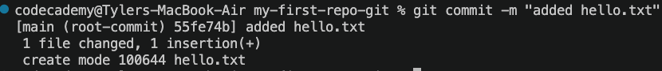
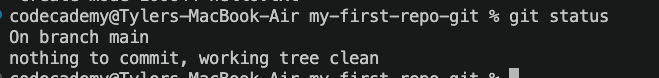

# My First Repo - Git Edition

## Create a new repo

0. Where do you want this repo to live?
   Option 1
   - Open the terminal
   - Navigate in the terminal
   - Check the path with pwd
     Option 2
     Note: Open the path in VSCode via Right click on folder > "Open in Integrated Terminal"
1. Use the git init commmand to create the repo

        - Type "git init" and hit enter in the terminal
2. Notice it created a .git folder in the location you were in, this is the repo
    - If you cant see the folder, "ls -a" will show the folder in the terminal

## Add files to it   
1. create a new file called hello.txt
```
touch hello.txt
```
2. Add "Hello World" to file contents and save
3. check for status of your repo
```
git status
```

4. We now "stage" the file to let git know what we want to commit
```
git add hello.txt
```
5. check for status of your repo
```
git status
```

6. commit the changes to the repo
```
git commit -m "added hello.txt"
```

7. check for status of your repo
```
git status
```
