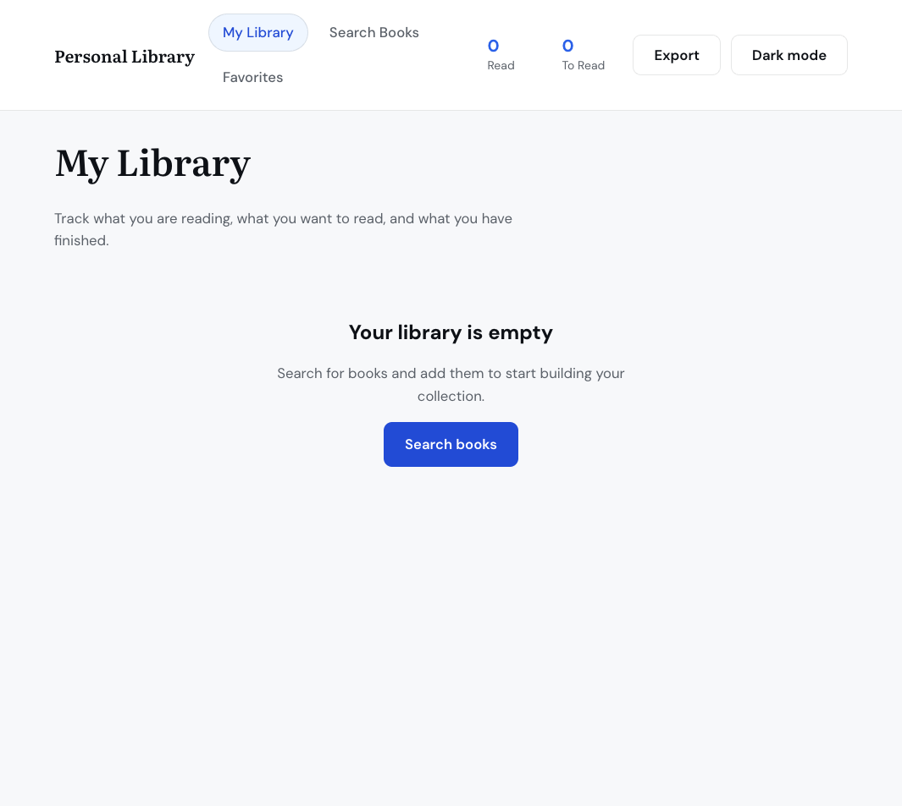

# Major 03: Personal Library App

FS12 Week 10 Session 3 — Major Project 3 (Option A). React + Vite library app with Google Books search, Context API, custom hooks, localStorage, favorites, filter/sort, and WCAG 2.1 AA patterns.



## Related locations

| Location | Purpose |
| --- | --- |
| `portfolio/major-03-personal-library/` (this folder) | Portfolio build output (`dist/`) for the site home card |
| [github.com/QABrandon/personal-library](https://github.com/QABrandon/personal-library) | Canonical source, local dev, class submission, and deploy |

Source code lives in the submission repo only. This folder keeps the built app so visitors can open it from the portfolio site without duplicating React/Vite project files here.

## Refresh the portfolio build

From the submission repo, build with stable asset names (no content hashes) so the portfolio copy stays human-readable:

```bash
cd personal-library-app
VITE_BASE_PATH=/portfolio/major-03-personal-library/dist/ npm run build
```

In the submission repo’s `vite.config`, use readable output names before building:

```js
build: {
  rollupOptions: {
    output: {
      entryFileNames: "assets/main.js",
      chunkFileNames: "assets/[name].js",
      assetFileNames: (info) =>
        info.names?.some((n) => n.endsWith(".css"))
          ? "assets/styles.css"
          : "assets/[name][extname]",
    },
  },
},
```

Then copy the build into this portfolio folder:

```bash
rsync -a --delete dist/ "/path/to/full-stack-2026/portfolio/major-03-personal-library/dist/"
```

After `npm run build`, open the portfolio card or visit `/portfolio/major-03-personal-library/dist/` on the deployed site.
