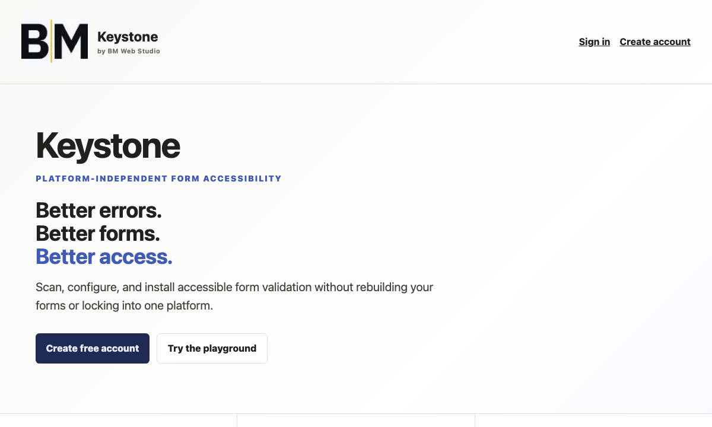

# Major 05: A11y Validator (Keystone)

Platform-independent form accessibility validator — scan, configure, and install accessible form validation without rebuilding forms or locking into one platform.

## Live project

**[https://keystone-web-omega.vercel.app/](https://keystone-web-omega.vercel.app/)**

## Highlights

- Native HTML first — uses `required`, `type`, `minlength`, `pattern`, labels, fieldsets, and browser semantics
- Reusable everywhere — standalone JavaScript engine for Webflow, React, WordPress, and plain HTML
- WCAG-informed — clear error identification, descriptions, focus management, summaries, and manual-review guidance

## Related locations

| Location | Purpose |
| --- | --- |
| `portfolio/major-05-a11y-validator/` (this folder) | Portfolio overview for the site project card |
| [keystone-web-omega.vercel.app](https://keystone-web-omega.vercel.app/) | Live deployed app |

The site card links to the live Vercel deployment so visitors can try the playground and sign-in flow directly.
