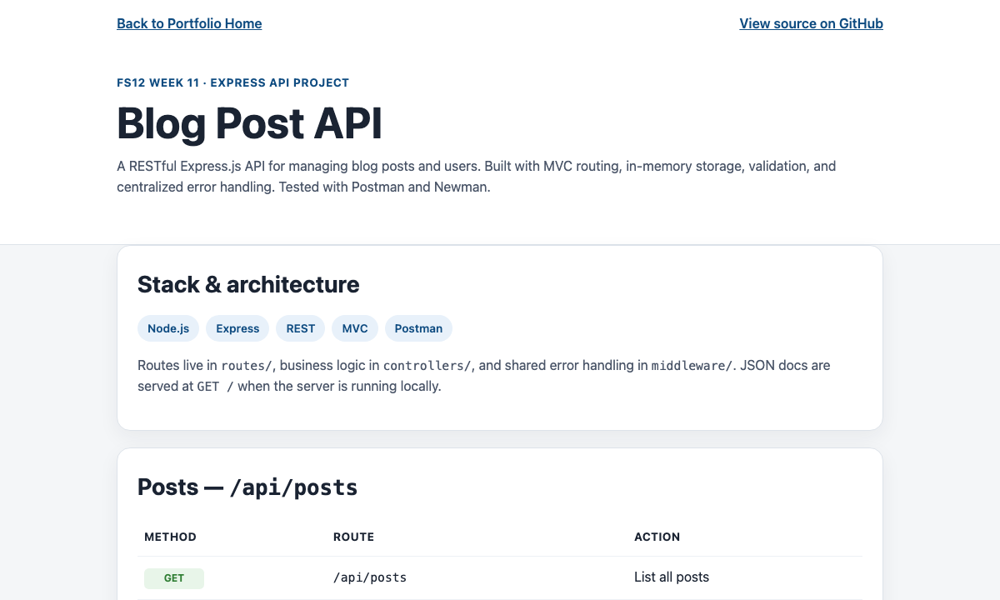

# Minor 05: Blog Post API

FS12 Week 11 Session 3 — Express API project (RESTful posts + users).

## Related locations

| Location | Purpose |
| --- | --- |
| `portfolio/minor-05-blog-api/` (this folder) | Static portfolio overview page (`index.html`) |
| [github.com/QABrandon/blog-api](https://github.com/QABrandon/blog-api) | Canonical source, local dev, class submission |

Source code lives in the submission repo only. This folder gives portfolio visitors endpoint documentation and a link to GitHub.

## Next major (Week 12)

Music Explorer API: [github.com/QABrandon/music-library](https://github.com/QABrandon/music-library) — portfolio folder `portfolio/major-04-music-library/`
